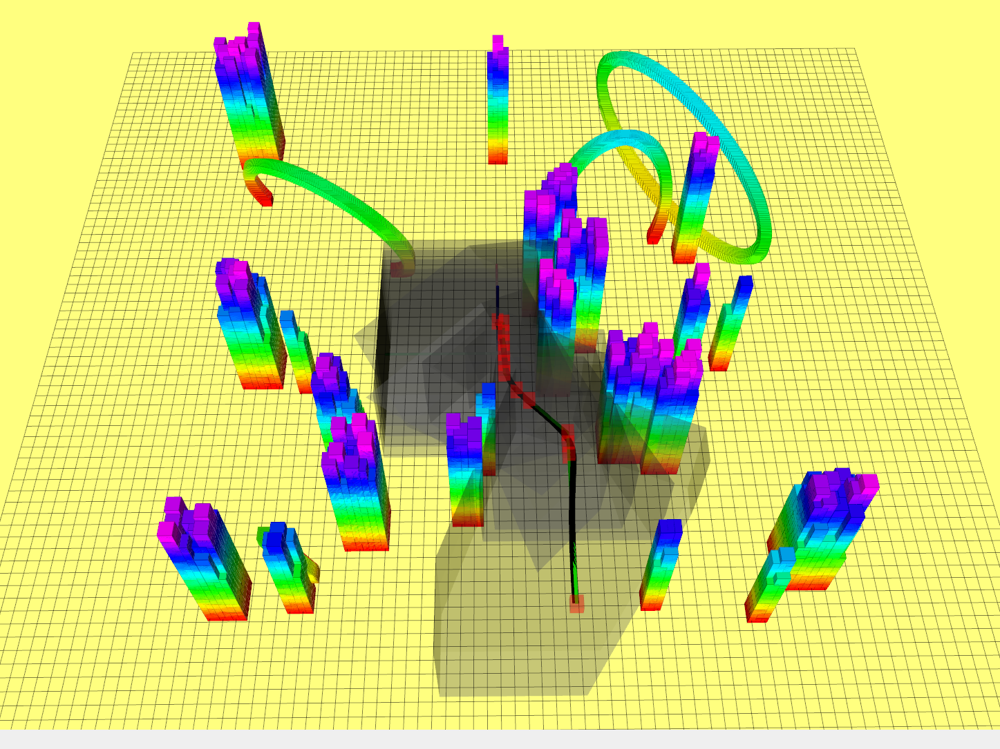

# JPS-MPC

This code allows you to select any point in the 3D map as a target and generates a collision-free trajectory from the starting point (0, 0, 1) to the target. The code uses a layered structure: initially, it employs Jump Point Search (JPS) to generate a global collision-free path, then creates a Safety Corridor (SC) around the JPS path. Finally, Model Predictive Control (MPC) is used to further generate a locally optimized trajectory.

## Quick Start

The project has been tested on Ubuntu 20.04 (ROS noetic). The backend optimizer is Gurobi. Please install the [Gurobi Optimizer](https://www.gurobi.com) (free academic lisence available).

Then simply run this commands:

```bash
git clone https://github.com/Lyn-Bamboo/JPS-MPC.git
cd JPS-MPC
catkin build
source devel/setup.bash
roslaunch grid_path_searcher demo.launch   
```

You will find the random map in ```Rviz```. You can select goals using the ```3D Nav Goal``` tool. 

<p align = "center">

</p>
